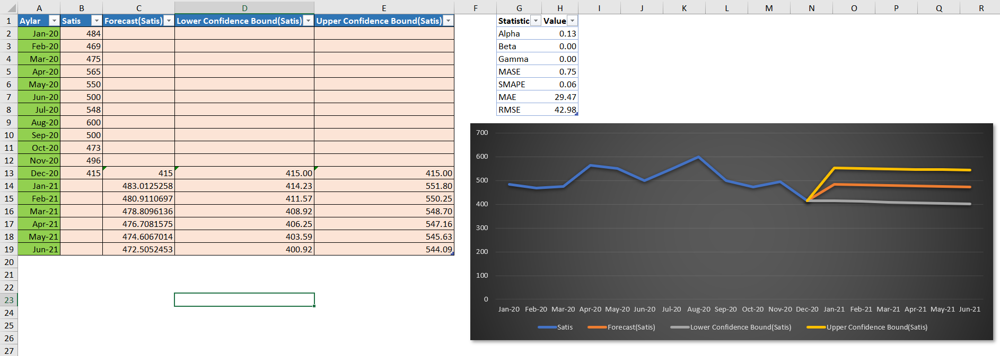

# 📊 Forecasting Analysis - Excel Project

This Excel project presents a **forecasting analysis** of sales data, including forecasted values, confidence intervals, and various statistical measures. The analysis helps to predict future sales and assess the accuracy of those predictions.

---

## 📁 Project Overview

This project contains the following key sections:

1. **Sales Data**: Historical sales data for the months of January 2020 to June 2021.
2. **Forecasting**: A forecast for future sales from January 2021 to June 2021, including confidence intervals (upper and lower).
3. **Statistical Metrics**: Various statistics that assess the accuracy of the forecast, such as **Alpha**, **Beta**, **Gamma**, and errors like **MAE**, **RMSE**, **SMAPE**, and **MAPE**.
4. **Visualization**: A line chart to visualize actual sales, forecasted sales, and the upper and lower confidence bounds for each month.

---

## 🔑 Key Features

### 1. **Sales Data**
The dataset includes monthly sales data from January 2020 to June 2021:
- **Months**: January 2020 to June 2021
- **Actual Sales (Satis)**: The actual sales for each month.
- **Forecasted Sales (Forecast(Satis))**: The forecasted sales for the months of January 2021 to June 2021.
- **Confidence Intervals**: The upper and lower bounds for the forecasted sales, representing the range of expected sales values.
  - **Lower Confidence Bound**: The minimum expected sales value based on the forecast model.
  - **Upper Confidence Bound**: The maximum expected sales value based on the forecast model.

### 2. **Forecasting**
Using historical data, the forecast was generated for sales in 2021 (January to June). The forecast is based on historical trends and incorporates a confidence level for the predictions.

- **Forecasted Sales** for **Jan-Jun 2021** are displayed alongside the actual sales values for **2020**.
- **Upper and Lower Confidence Bounds** are visualized as part of the forecast, showing the range of likely outcomes.

### 3. **Statistical Metrics**
The following key statistics are calculated to assess the quality of the forecast:
- **Alpha**: 0.13  
  The smoothing factor used in the forecast model.
- **Beta**: 0.00  
  The trend adjustment factor.
- **Gamma**: 0.00  
  The seasonal adjustment factor.
- **MASE (Mean Absolute Scaled Error)**: 0.75  
  Measures the accuracy of the forecast model.
- **SMAPE (Symmetric Mean Absolute Percentage Error)**: 0.06  
  Measures the accuracy of the forecast as a percentage.
- **MAE (Mean Absolute Error)**: 29.47  
  The average magnitude of errors in the forecast.
- **RMSE (Root Mean Squared Error)**: 42.98  
  A measure of the average of the squares of the errors.

### 4. **Visualization**
A line chart visualizes the following:
- **Actual Sales (Satis)**: The actual sales for the months of January 2020 to June 2021.
- **Forecasted Sales (Forecast(Satis))**: The forecasted sales for the months of January 2021 to June 2021.
- **Lower Confidence Bound**: The lower range for the forecasted sales.
- **Upper Confidence Bound**: The upper range for the forecasted sales.

The chart allows users to compare actual and forecasted sales and visualize the accuracy of the forecast based on the confidence intervals.

---

## 🧑‍💻 Technologies Used

- **Microsoft Excel** for data management, forecasting, and visualization.
- **Excel Formulas** for calculating the forecast, confidence intervals, and statistical metrics.
- **Charts** (Line, Scatter) to visualize actual sales, forecasted sales, and confidence bounds.

---

## 🚀 Use Cases

- **Sales Forecasting**: Predict future sales trends based on historical data.
- **Decision Making**: Help businesses make informed decisions based on predicted sales data.
- **Accuracy Evaluation**: Assess the quality and reliability of sales forecasts using error metrics.
- **Confidence Analysis**: Understand the range of possible outcomes with upper and lower confidence bounds.

---

## 🧠 Future Enhancements

- **Real-Time Data Integration**: Integrate live data to update the forecast automatically.
- **Advanced Forecasting Models**: Implement other advanced forecasting techniques like **ARIMA** or **Exponential Smoothing**.
- **Error Analysis**: Improve the accuracy of the model by analyzing and reducing forecast errors.
- **Visualization Enhancements**: Add interactive filters to adjust the forecast view based on various conditions (e.g., regions, product types).

---

## 📷 Screenshot of Forecasting Visualization

> *Ensure the images are correctly linked in your repo directory.*

---

## 🧑‍💼 Author

- **[Abdulsalam Alizade]**  
Data Analyst | Excel Expert | Forecasting Specialist

---

